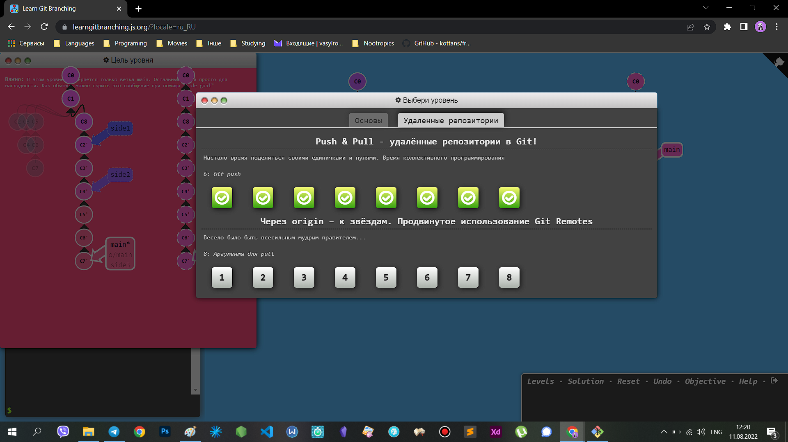

# kottans-frontend

**Git basics**

This is [my repo](https://github.com/VasylRosokha/kottans-frontend)

### Udacity

### Learnbranching

## Linux CLI, and HTTP

About HTTP, it was new and a little difficult for me but interesting.
